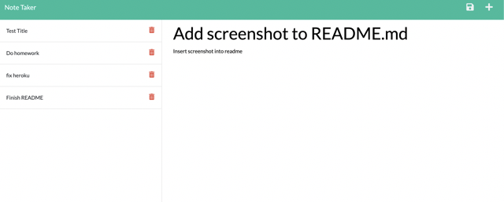
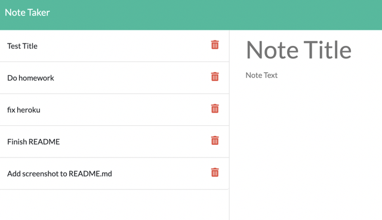

# Note-Taker

## Description
The motivation for this project was to create an application called Note Taker that could be used to write and save notes. The starter code provided the front end so it was my job to build the back end and connect the two and then deploy the entire application to Heroku.

## Table of Contents 

If your README is long, add a table of contents to make it easy for users to find what they need.

- [Installation](#installation)
- [Usage](#usage)
- [License](#license)

## Installation
Go to this [Website](https://note-taker20.herokuapp.com/notes)  
The website provided is the link to the heroku page where the application was deployed.

## Usage
`Type in task`  

`Shows saved task`  

## License

